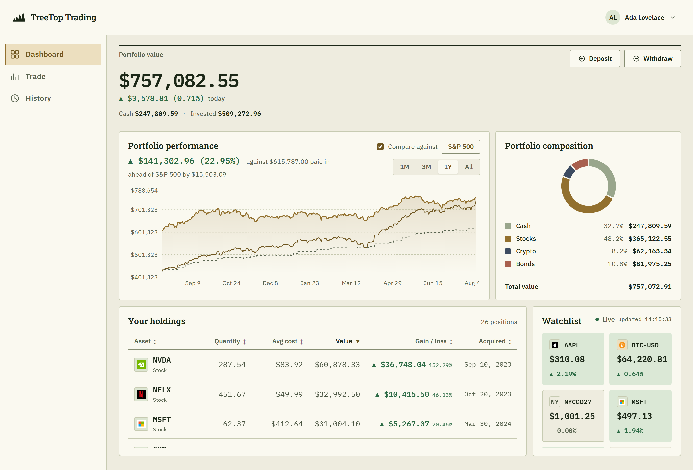
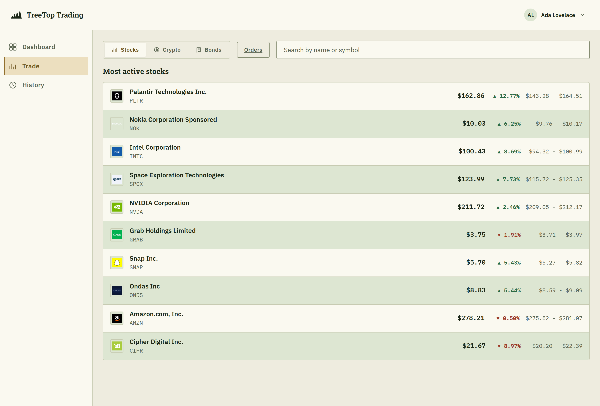
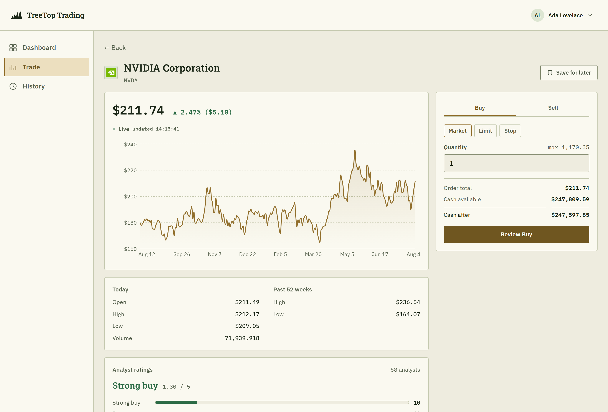
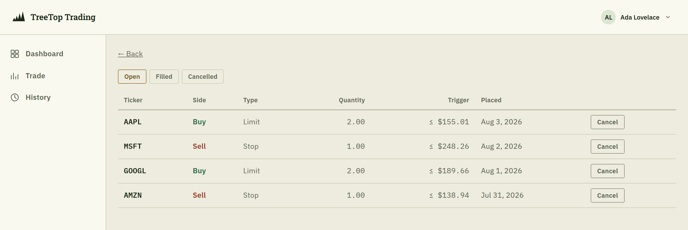
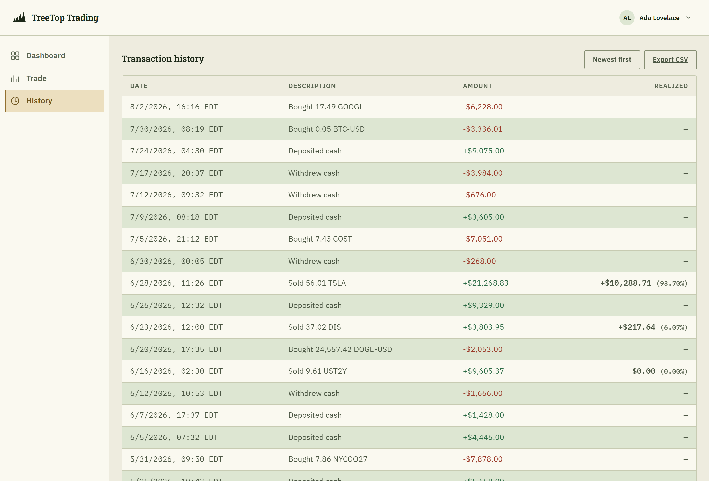
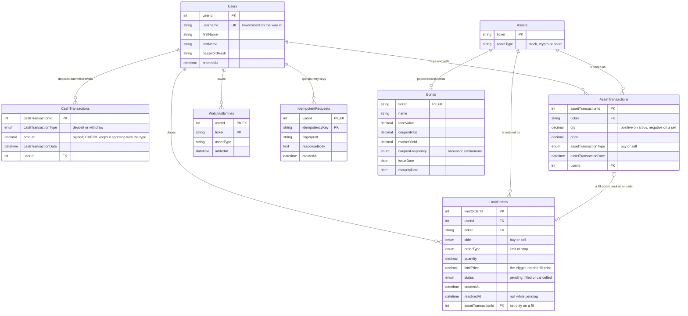

# TreeTop Trading

A paper-trading app. You get a cash wallet, real market data, and everything you
need to run a portfolio with it: buy and sell stocks, crypto and bonds, leave
conditional orders that fill while you're away, and watch how you're doing
against what you paid in and against the index.

Nothing here touches real money. Prices are real; the account is not.

Built for TAP 2026 by team 02.



---

## What it does

### Your portfolio, on one screen

- **Portfolio value.** Cash plus every position at the current market price,
  with today's move on the whole book.
- **Performance over time.** 1 month to 5 years, charted against the money you
  actually paid in. A portfolio that grew because you deposited more hasn't
  performed, and the chart says so.
- **Compare against anything.** The default is the S&P 500, but the benchmark is
  any asset the app can price, so "what if I'd just bought Bitcoin" is as
  answerable as "did I beat the index". Your deposits are matched day for day, so
  the comparison isn't flattered by timing.
- **Composition.** How the money splits across cash, stocks, crypto and bonds.
- **Holdings.** Quantity, average cost, market value, gain/loss and when you
  first bought in, sortable by any column.
- **Watchlist.** Save tickers you're considering, with live prices. Before
  you've saved anything it shows the day's most active stocks instead.

### Trading



- **Three kinds of asset.** US-listed stocks and crypto are quoted live; bonds are
  a synthetic catalog priced from their own terms (the present value of their
  remaining coupons plus face value), because no feed quotes them.
- **Search or browse.** Most-active listings per asset type, or search by name or
  symbol.
- **An asset page worth reading**: a year of daily closes, today's open/high/low
  and volume, the 52-week range, and Wall Street's analyst consensus with its
  price targets where there is coverage.
- **Market orders with a review step.** Nothing moves on one click: you see the
  cost, your cash before and after, and your holding after, then confirm. The
  quantity box knows your maximum: your cash on a buy, your position on a sell.



- **Limit and stop orders** on stocks and crypto, good till cancelled. A limit
  waits for a price at least as good as your trigger; a stop waits for one at
  least as bad: a stop loss, or a breakout entry. The panel spells out which way
  round the one you're placing runs.
- **They fill without you.** A background poller checks pending orders against
  the market every few seconds and fills them at the price prevailing at that
  moment, not at the trigger. Whatever screen you're on, a toast tells you it
  happened, and your balance updates.
- **Bonds redeem themselves.** A bond that reaches maturity is paid out at face
  value automatically, booked like any other sale.



### Money and history



- **Deposit and withdraw** with the same review-then-confirm flow.
- **Every deposit, withdrawal, buy and sell**, newest or oldest first, paged, and
  exportable as CSV.
- **Realized gain/loss on every sale**, measured against the average cost of the
  position it came out of, the same basis the open positions are judged on.
- **Balances are never stored.** Your cash is the sum of the ledger, recomputed
  on every read, so it cannot drift from the transactions behind it.

### Live prices

Quotes are pushed over a socket rather than polled by the browser: symbols
stream from Yahoo where it carries them, with a five-second server-side poll
covering everything else: a shut market, a symbol the stream skips, a stream
that quietly died. A "Live · updated 14:15:33" stamp ticks on every update
received, because a working feed and a broken one look identical when the market
is closed and the price simply never changes.

### Accounts

Register with a username and password (hashed, never stored in the clear), stay
signed in through an httpOnly session cookie, and edit your name, username or
password from the account screen.

---

## Data model

Seven tables plus one for retry safety. Two conventions run through all of them:
**nothing derived is stored** (a balance, a position, a cash effect is always
recomputed from the rows behind it), and **transactions are append-only**:
nothing updates or deletes them, which is why they carry no `updatedAt`.



A few decisions the diagram doesn't explain on its own:

- **`Assets` is what says a ticker is a stock, a crypto or a bond.** It's a
  property of the ticker, not of the trade, so adding a kind of asset is an
  `INSERT` rather than an `ALTER` on an enum.
- **`WatchlistEntries` deliberately has no foreign key to `Assets`.** That table
  records what has been *traded*, and the whole point of a watchlist is to follow
  something before you buy it, so the asset type rides on the row instead.
- **`LimitOrders` is the one mutable row.** It moves from `pending` to exactly one
  of `filled`/`cancelled`, which is why it carries a `resolvedAt` and the
  transaction tables don't.
- **Every timestamp is UTC**, and the database's own `now()` is pinned to agree
  with what the application writes.

The schema lives in [`server/db/models.py`](server/db/models.py); every change to
it is an Alembic revision under [`server/migrations/`](server/migrations/).

---

## Running it locally

You'll need Python 3.12+ and Node 22+. Two processes, both needed.

```bash
# server: http://localhost:5000
cd server
python -m venv venv
./venv/Scripts/activate          # source venv/bin/activate on macOS/Linux
pip install -r requirements.txt
cp .env.example .env             # then set DATABASE_URL (see below)
alembic upgrade head             # creates or updates the schema
python app.py
```

`DATABASE_URL` arrives empty, which builds a MySQL URL from the `DB_*` variables.
For a zero-setup local run put `DATABASE_URL=sqlite:///dev.db` in `server/.env`
instead. SQLite needs no database to exist first; MySQL needs its (empty)
one created.

```bash
# client: http://localhost:5173
cd client
npm install
npm run dev
```

Open http://localhost:5173. The client proxies `/api` and `/socket.io` to the
server, so both have to be running.

### Demo data

An empty account is not much to look at. The seed script builds one with ~3 years
of history: stocks, crypto and bonds, priced from real market data, which is
what makes the performance chart, the composition donut and the holdings table
worth opening.

```bash
cd server
python -m scripts.seed --username demo --password demopassword --first Ada --last Lovelace
```

Then sign in as `demo` / `demopassword`. Re-running regenerates that user's
transactions, so it's safe to repeat. The screenshots above are that account.

To keep demo data out of your working database, point it somewhere separate:

```bash
DATABASE_URL=sqlite:///demo.db alembic upgrade head
DATABASE_URL=sqlite:///demo.db python -m scripts.seed
DATABASE_URL=sqlite:///demo.db python app.py
```

`scripts/set_password` resets a password if you lock yourself out of an account.

---

## Tests

```bash
cd server && pytest              # services and routes
cd client && npm test            # components and the API layer
cd e2e    && npx playwright test # full stack, real browser
```

The end-to-end suite starts its own server and client against a throwaway
database with a deterministic stand-in for the market feed, so it can trade,
watch a conditional order fill, and never depend on a third party being up. All
three run on every push and pull request.

---

## Layout

```
server/     Flask + SQLAlchemy API, Socket.IO quote feed, background order poller
client/     React + TypeScript, built with Vite
e2e/        Playwright specs that drive both
assets/     Screenshots and design artifacts
```

Interactive API docs are served by the running server at `/apidocs`, generated
from the same schemas that validate incoming requests.

**[ARCHITECTURE.md](ARCHITECTURE.md)** covers the rest: how the layers fit
together, the API conventions, configuration, the live price feed, deployment,
and how to change the schema.
